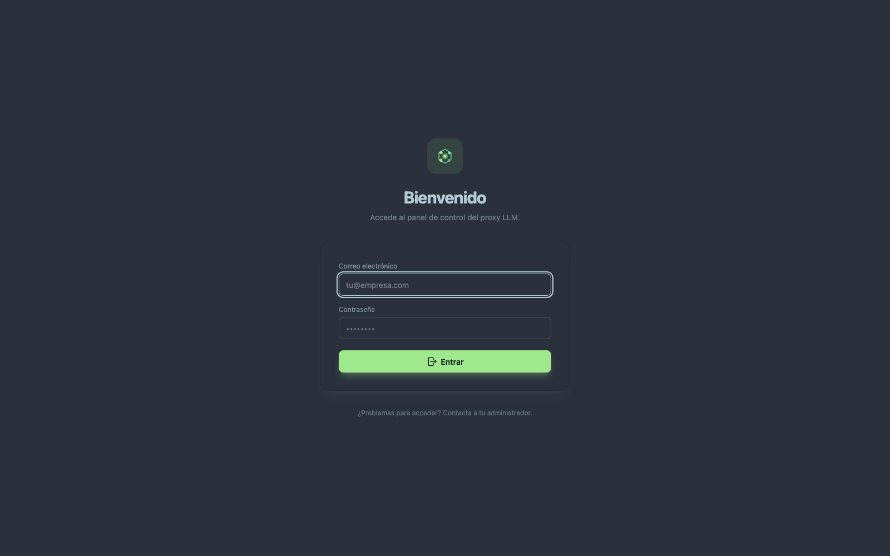
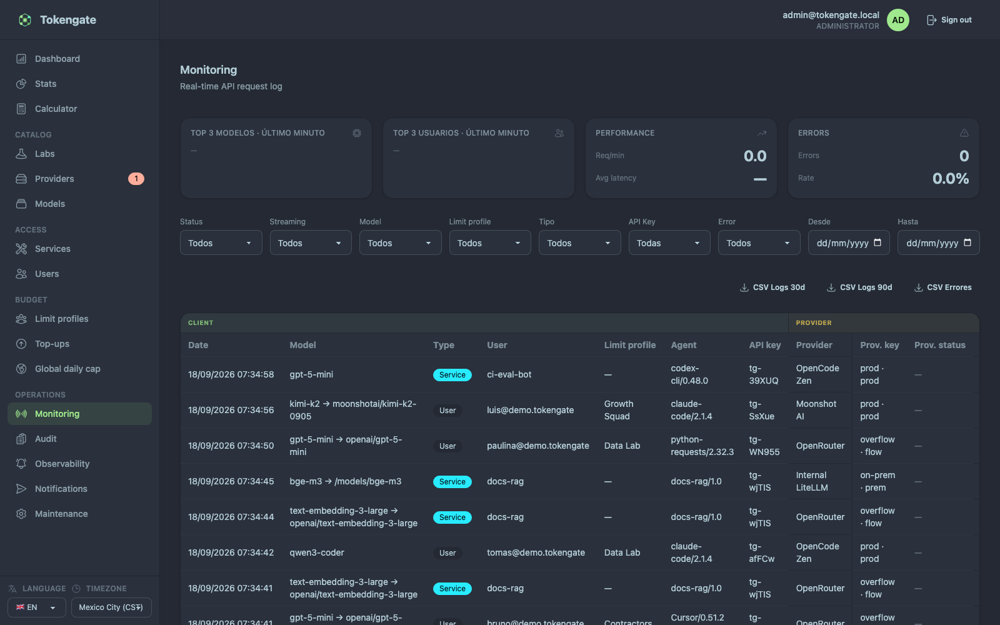
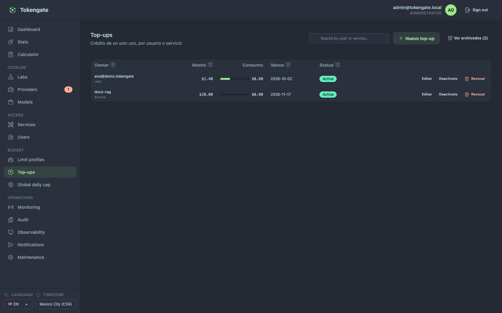

<div align="center">


# TokenGate

### One gate in front of every model. Routing, budgets and cache intelligence in between.

### OpenAI-compatible LLM API gateway

[](LICENSE)
[](./mix.exs)
[](https://elixir-lang.org)
[](https://www.phoenixframework.org)
[](https://www.postgresql.org)

</div>

## What is TokenGate

TokenGate sits between your agents/apps and the model providers. Clients call TokenGate
with a TokenGate API key using the **OpenAI SDK unchanged** (just base URL + key);
TokenGate routes each request to the best provider credential — with per-subject
budgets, rate limits, circuit breakers, prompt-cache intelligence and cost
accounting in between.

Think "LiteLLM, but as an Elixir app with a real admin UI".

The UI ships in **English by default** with an in-app **EN/ES** selector
(`users.locale`); some strings are still Spanish-only.

## Screenshots

<div align="center">

| Login | Dashboard |
|:---:|:---:|
|  |  |
| **Stats** | **Provider ranking** |
|  |  |
| **Monitoring** | **Top-ups** |
|  |  |

</div>

## Routing (proxy API)

- **OpenAI-compatible proxy** — `GET /v1/models`, `POST /v1/chat/completions`
  (streaming SSE + non-streaming) and `POST /v1/embeddings`, plus the rest of a
  provider's services as transparent passthroughs on the same `base_url`:
  `POST /v1/rerank`, `/v1/audio/transcriptions`, `/v1/audio/speech`,
  `/v1/images/generations`, `/v1/videos`, `/v1/music/generations`.
- **Model aliases + type routing** — clients ask for an alias (`gpt-4o`); it maps
  to one or more provider routes with `model_type` (`llm`/`embedding`) selecting
  the right endpoint. Switching backends is an admin operation, not a client deploy.
- **Health + priority routing** — candidates sort by `{health, priority}`: healthy
  credentials first, slow ones sinking below until they recover; within a level,
  `priority` ASC decides. Billing surface (subscription vs pay-per-token) does
  **not** rank candidates — order is priority alone.
- **Fallback + circuit breaker** — auth errors (401/402/403) permanently disable
  the credential and fall back; timeouts (and first-token timeouts) fall back
  immediately; other errors retry the provider before moving on. Per-credential
  breaker with configurable threshold/cooldown. Every upstream attempt of one
  client request carries the same generated `Idempotency-Key`.
- **Two-gate throttling** — per-subject limits (RPM, concurrency) protect
  TokenGate; per-provider limits (`max_rpm`, `max_concurrent`,
  `max_concurrent_per_user`) protect the upstream key — every credential of a
  provider inherits them, and the per-user gate is keyed by
  `{credential, api_key}` so one heavy user can't swallow a shared subscription.

## Cache intelligence

- **Sticky routing** — an API key sticks to the same credential to preserve prompt
  caches, with per-route TTL overrides (default 3 min). Every outbound request also
  carries an `x-session-affinity` header so providers with automatic prefix caching
  group a session's requests onto the replica holding the cached prefix.
- **Conversation session key** — the gateway derives a per-conversation key
  (client `x-session-id` header or `prompt_cache_key` body field, or hashed from
  the conversation opening) for cache-affinity routing and per-conversation
  cache-hit observability. It travels upstream as `prompt_cache_key`; the
  OpenRouter-style `session_id` body field is never sent.
- **Local response cache** — identical non-streaming requests (same key + model +
  canonical payload) are served from an in-process ETS cache without touching the
  upstream: faster answers, $0 cost.
- **Prompt optimizer** — every chat completion gets system messages hoisted and
  deduped and long/repeated tool-output messages trimmed. Pure, deterministic,
  always on for LLMs. Multi-turn histories get reasoning blocks stripped before
  replay.
- **Usage normalization** — OpenAI-compatible usage is normalized into
  `prompt_tokens` / `completion_tokens` / `cache_read_tokens` /
  `cache_creation_tokens`, priced separately at cache rates.

## Budgets & credit

- **Limit profiles** (formerly "groups"/"subs") — the subject each member inherits
  a monthly spend cap from (`monthly_spend_limit_usd`), plus **service** caps of
  their own. `unlimited_spend` is the only path to unlimited.
- **Top-ups** — one-shot credit per **user or service**, with optional expiry.
  Consumed-vs-granted is measured against the request logs; a top-up can be
  deactivated/reactivated or revoked, and it's archived (not deleted) once drained
  or expired. Live in `/budget/topups`.
- **Draining order** — the monthly limit is spent first; once exhausted (or on a
  zero/absent limit) the top-up that **expires soonest** is drained.
- **Global daily kill-switch** — instance-wide per-UTC-day USD cap
  (`/budget/global`); once total spend reaches it, all proxy requests are rejected
  until 00:00 UTC. Users, limit profiles and services can be exempted.
- **Cost tracking** — the provider-reported usage cost is the single cost dimension,
  recorded per request and returned in the `X-Tokengate-Cost` header
  (LiteLLM upstreams via `x-litellm-response-cost`; Surplus Intelligence via
  `x-si-buyer-cost-micro`, both micro-USD). No upstream cost → manual per-route
  pricing → `$0`; no phantom estimates.

## Admin console (LiveView)

| Page | What it does |
|---|---|
| `/dashboard` | Personal live consumption, period selector, the user's API key with rotate/revoke, supervised-services shortcut |
| `/stats` | Analytics hub — Live pulse + tabs: Overview, Providers (tier/score ranking), Models, Limit profiles, Users, Services. Role-scoped, prev-period deltas, CSV export (`/stats/export`) |
| `/calculator` | Real provider spend vs an estimated cost from custom pricing (input/cache/output per M + cache hit-rate) |
| `/catalog/labs` | Labs catalog — read-only models.dev labs + operator **custom** labs (name, key, icon/logo) |
| `/catalog/providers` | Provider CRUD with multiple credentials each; per-provider operational limits; billing surface label |
| `/catalog/models` | Model alias CRUD — provider routes by priority, exclusive scope, manual per-route pricing |
| `/access/services` | Machine services: own API keys, monthly cap + top-ups, supervisors, granted models |
| `/access/users` | User CRUD, suspend/activate, impersonation, per-user stats and spend limits |
| `/budget/profiles` (+ `/:id/members`) | Limit profiles — monthly cap, unlimited flag, membership, per-member RPM/concurrency extras and model grants |
| `/budget/topups` | One-shot top-ups per user/service: consumed vs granted, deactivate/reactivate, revoke, archived when drained/expired |
| `/budget/global` | Global daily cap kill-switch + exemptions |
| `/services/supervised` (+ `/:service_id`) | Read-only view for service supervisors — access comes from a live `service_supervisors` row (no role grants it; removing the row revokes it) |
| `/operations/monitoring` | Live request log, filters, in-flight requests, CSV export |
| `/operations/audit` | Admin audit log — actor (+ impersonator), action, entity, IP, redacted change set; filters, pagination, CSV export (`/operations/audit/export`) |
| `/operations/observability` | OTLP/JSON webhook destinations (HMAC-signed, delivered via Oban) |
| `/operations/notifications` | Telegram notifications — bot token (encrypted or env), events + severity/cooldown, quiet hours, linked chats, delivery log with manual resend |
| `/operations/maintenance` | Config overview + danger zone (reset logs, reset sticky sessions) |

## Platform

- **Hot path on ETS** — auth, limits, budgets, routing and metrics read from ETS/atomics
  only; Postgres is written asynchronously. Named tables degrade gracefully when absent.
- **Postgres** — daily RANGE-partitioned `request_logs` (append-heavy by design),
  monthly-partitioned **append-only** `audit_logs` (trigger rejects UPDATE/DELETE),
  hourly metrics rollup with worker + backfill, Oban jobs.
- **Auth** — email/password (Bcrypt) + optional Google OAuth with domain-restricted
  auto-registration; sliding-expiration sessions; per-user timezone bucketing;
  admin impersonation.

## Quick start

```bash
git clone git@github.com:alvarolizama/tokengate.git && cd tokengate
mix setup        # deps → create DB → migrate → assets → seed admin + dev dataset
mix phx.server
```

Visit [localhost:4000](http://localhost:4000) and sign in with the seeded admin:

| | Default | Override with |
| --- | --- | --- |
| Email | `admin@tokengate.local` | `TOKENGATE_ADMIN_EMAIL` |
| Password | `tokengate-admin-secret-1` | `TOKENGATE_ADMIN_PASSWORD` |

Then: create a **provider** with a credential → create a **model** alias and assign the
provider → give a **limit profile** a monthly cap → your member API key is already on
your dashboard. You can proxy a request in ~5 minutes.

### Demo dataset (a month of usage)

To exercise every screen with real data instead of an empty instance:

```bash
mix ecto.demo    # priv/repo/demo_seeds.exs — idempotent, safe to re-run
```

Seeds 31 days of synthetic traffic (~7.7k request logs) plus the full surface
around it: 12 demo users and 4 limit profiles (one unlimited, one deliberately
over-budget), 3 machine services (own cap / one-shot top-up / unlimited) with
supervisors, 2 custom providers + credentials in `error`/`disabled` states,
11 models with manual pricing and exclusive routes (member / profile / service),
credit top-ups (active, drained, expired), observability webhooks, a custom lab,
and a month of audit entries. The hourly metrics rollup is rebuilt for the whole
range, and the top-ups are calibrated to the generated spend.

Everything it creates is marked (users at `@demo.tokengate`, fixed profile/service/lab
names, `sk-demo-` credential keys) and wiped on the next run — operator data is
never touched. `audit_logs` is append-only, so its demo entries are seeded once
and preserved. Re-running produces identical row counts. The script prints the
demo API keys at the end:

| | Value |
| --- | --- |
| Demo users | `<name>@demo.tokengate` |
| Password | `DemoPassw0rd!2026` |
| Admin dashboard | the seeded admin also gets a demo membership |

`mix run priv/repo/demo_verify.exs` re-checks the dataset by calling the same
context functions the LiveViews use (one line per screen).

## Using the proxy

```python
from openai import OpenAI

client = OpenAI(
    base_url="http://localhost:4000/v1",
    api_key="tg-…",   # TokenGate API key (member or service)
)

resp = client.chat.completions.create(
    model="gpt-4o",   # the TokenGate alias, not the provider's model id
    messages=[{"role": "user", "content": "Hello"}],
)
```

## Configuration

**Required in production** (boot fails without them):

| Var | Purpose |
| --- | --- |
| `DATABASE_URL` | Postgres connection string |
| `SECRET_KEY_BASE` | Phoenix secret (`mix phx.gen.secret`) |
| `PHX_HOST` | Public host |
| `WEBHOOK_SECRET` | HMAC key for observability webhook deliveries |
| `SESSION_SIGNING_SALT` / `SESSION_ENCRYPTION_SALT` | Session cookie salts (`mix phx.gen.secret 32`) |

**Common optional knobs:**

| Var | Default | What it tunes |
| --- | --- | --- |
| `PORT` | `4000` | HTTP port |
| `POOL_SIZE` | `10` | DB connection pool |
| `SESSION_MAX_AGE_SECONDS` | `31536000` | Idle session lifetime (sliding) |
| `SESSION_COOKIE_SECURE` | auto | Force/clear the cookie `Secure` flag; unset = Plug default (secure only on HTTPS) |
| `PROXY_RECEIVE_TIMEOUT_MS` | `120000` | Upstream read timeout (per-provider override) |
| `FIRST_TOKEN_TIMEOUT_MS` | `30000` | Streaming: max wait for first chunk |
| `CIRCUIT_BREAKER_THRESHOLD` | `3` | Failures before a breaker opens |
| `CIRCUIT_BREAKER_COOLDOWN_MS` | `30000` | Breaker open duration |
| `CIRCUIT_BREAKER_RATE_LIMIT_COOLDOWN_MS` | `20000` | Breaker cooldown after a 429 |
| `ROUTING_SLOW_THRESHOLD_MS` | `30000` | Latency that marks a credential degraded |
| `ROUTING_SLOW_PENALTY_MS` | `120000` | How long a slow credential sinks below healthy ones |
| `ECTO_SSL` / `ECTO_SSL_VERIFY` | on / off | DB SSL and cert verification |
| `ECTO_IPV6` | off | Connect to the DB over IPv6 |
| `PHX_SCHEME` / `PHX_PORT` | `https` / `443` | URL generation (set `http` behind a VPN proxy) |
| `CHECK_ORIGINS` | unset | Comma-separated allowed origins for CSRF/WS checks |
| `TOKENGATE_ADMIN_PASSWORD` | unset | Set it to bootstrap the admin at boot; unset = first admin created from `/onboarding` |
| `TOKENGATE_ADMIN_EMAIL` | `admin@tokengate.local` | Email of the bootstrapped admin (only used with the password) |
| `TELEGRAM_BOT_TOKEN` | unset | Telegram bot token (else read encrypted from the UI) |
| `GOOGLE_OAUTH_CLIENT_ID` / `SECRET` | unset | Enable Google sign-in |
| `GOOGLE_OAUTH_ALLOWED_DOMAINS` | unset | Domains allowed to auto-register |
| `GOOGLE_OAUTH_REDIRECT_URI` | derived | Override the OAuth callback URL |
| `DNS_CLUSTER_QUERY` | unset | Node clustering DNS query |

`.env.example` is the **complete template** — core, session and this app's own
variables, each with its comment and a safe default:
`cp .env.example .env && $EDITOR .env`.

## The UI standard

The UI follows the family's **Commons** — theme and tokens, layout and responsive,
elements and **buttons by context**, cards, tables, modals, search pickers, charts,
states, shell — copied **byte-exact** from the `boilerplate` repo's `DESIGN.md`,
plus the section this app owns at the end of that same file: `## Custom — TokenGate`.

The Commons is edited **in the boilerplate repo and only there**, and propagates by
copying; an app never edits it in place. To see whether this app is still carrying
it byte-exact:

```bash
bash path/to/boilerplate/skeleton/check-commons.sh .   # exit 0 = Commons intact
```

## Production (Docker)

Multi-stage **Dockerfile** included: prebuilt hexpm Elixir image → slim Debian runtime,
non-root `app` user, port `4000`. The entrypoint applies migrations and seeds the admin
before boot; `SKIP_MIGRATIONS=1` bypasses.

**Ports:** `PORT` (container, default `4000`) **must equal the platform's _Ports Exposes_**
— that is the real listen port. `PHX_PORT` / `PHX_SCHEME` only feed the generated URLs
(the external ones: `443` / `https`, or `4000` / `http` behind a VPN). The image sets no
`EXPOSE`: it would not change the listen.

**HTTPS:** `force_ssl` is compile-time and the image ships **HTTPS on**, like the rest
of the family. This instance is deployed over plain HTTP behind a VPN, so the build
passes `--build-arg DISABLE_FORCE_SSL=1` (in the platform's **build** variables, not
the runtime ones) and the runtime sets `PHX_SCHEME=http`. The two always move together:
with `force_ssl` on and `PHX_SCHEME=http`, Plug.SSL redirects every request to HTTPS —
and the port in that redirect cannot be configured (`Plug.SSL` fixes it at 443 for HSTS)
— where nothing is listening. The healthcheck would not catch it: it hits `127.0.0.1`,
which `config/prod.exs` excludes from the redirect, so the container keeps reporting
healthy while users hang.

Boot runs `priv/repo/seeds_prod.exs`: it creates **only** the admin user, and only when
`TOKENGATE_ADMIN_PASSWORD` is set (`TOKENGATE_ADMIN_EMAIL` optional, defaults to
`admin@tokengate.local`). The demo datasets (`priv/repo/seeds.exs`,
`priv/repo/demo_seeds.exs`) are development-only and refuse to run inside a release.

### First run

A fresh instance has no users, and without one there is nothing to log in with: `/` (and
`/login`) redirect to **`/onboarding`**, where the first account you create becomes the
global admin. The page disables itself — both actions bounce to `/login` as soon as a
user exists, and `Accounts.create_first_admin/1` re-checks inside a transaction under an
advisory lock, so it cannot be used to mint a second admin (a double-click or two
replicas racing the form can't either).

That leaves a window: whoever reaches the instance first can claim it. Close it by
deploying behind your network boundary, or by setting `TOKENGATE_ADMIN_PASSWORD` so the
boot creates the admin before the app is ever exposed. Without that variable the boot
creates **nothing** — never a fallback password from this repository.

```bash
docker build -t tokengate .
docker run -p 4000:4000 --env-file .env tokengate
```

> 🩺 **Healthcheck:** the image ships a `HEALTHCHECK` on **`GET /health`** — a bare `200`
> that touches no database, so it passes while the boot tasks warm the connection pool.
> Point the proxy's health check at `/health` expecting `200`, **not** at `/`: `/`
> redirects to `/login` (302) and a proxy configured for 200 reports a healthy container
> as down → 502 Bad Gateway. Note the window before the listener exists: the entrypoint
> runs migrations first, so a proxy that gives up sooner will 502 during a deploy.

> ⚠️ **Migrations on partitioned tables:** `CREATE INDEX` on `request_logs` cannot use
> `CONCURRENTLY` (Postgres limitation). On a large existing table, run migrations in a
> maintenance window.

## Tests and gates

```bash
mix precommit   # the gate that closes the loop
```

The `/health` probe carries its own test that runs **without** a sandbox owner
(`test/tokengate_web/controllers/health_controller_test.exs`): a `/health` that queried
the database would answer 503 there and turn the suite red. That is the regression the
container's `HEALTHCHECK` depends on not happening, so the test pins it structurally
rather than by convention.

## Tech stack

Phoenix 1.8 + LiveView · Bandit · Ecto/Postgres (RANGE partitions) · Finch (upstream
HTTP/SSE) · Req (outbound) · Oban · Tailwind CSS v4 + daisyUI (dim) · esbuild ·
bcrypt_elixir

## Development

```bash
mix precommit   # compile --warnings-as-errors → deps.unlock --unused → deps.audit → format → gettext check → test
```

## License

Released under the [MIT License](LICENSE) — Copyright (c) 2026 Álvaro Lizama.
The license covers the whole repository: the Phoenix server, the admin UI and
the Docker production image. Third-party dependencies keep their own licenses.
