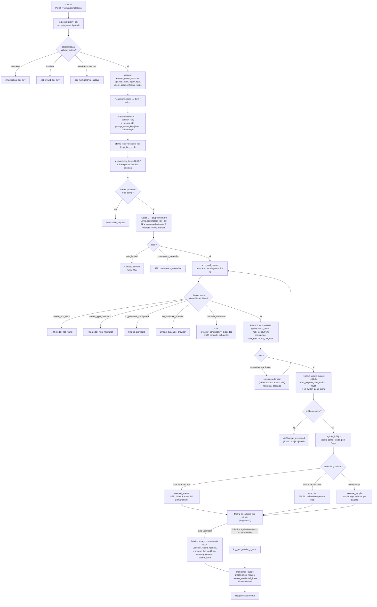
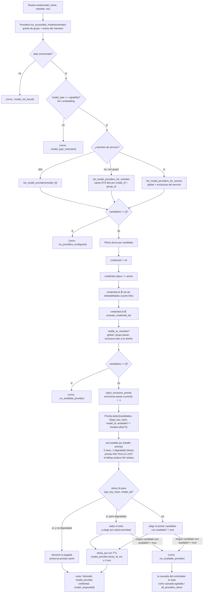
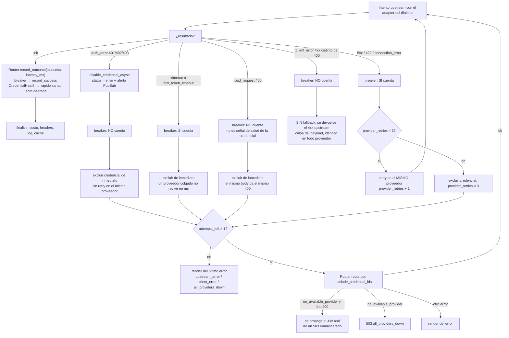
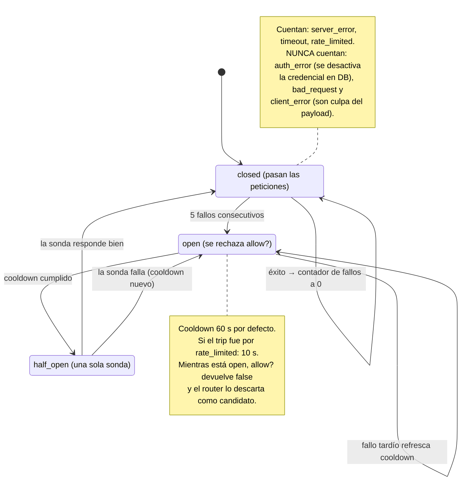
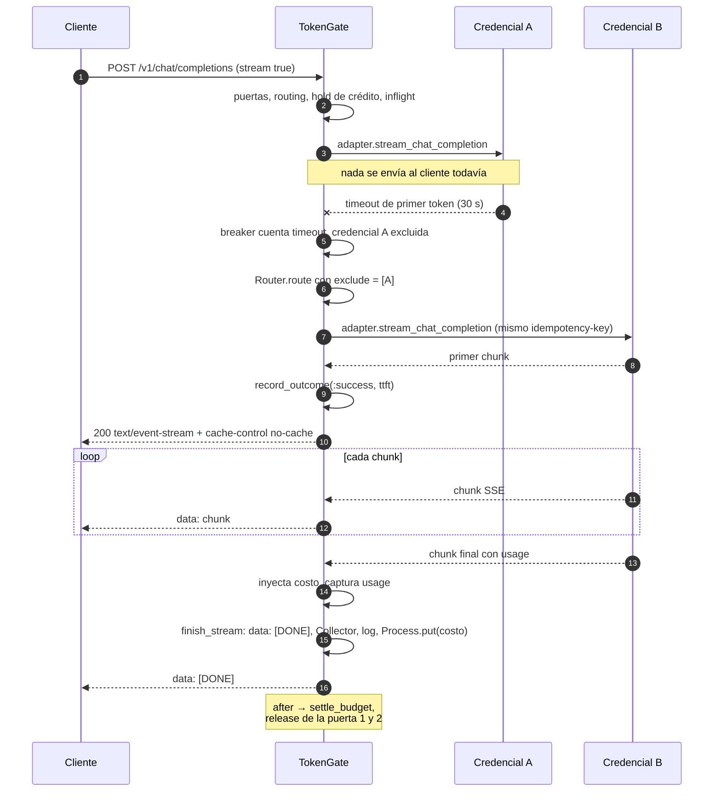

# Flujo de una petición en el proxy de TokenGate

Referencia de código: `main` @ `61e6610`.
Todo lo que aparece aquí sale del código; los números de línea son del estado actual del repo.

| Fuente | Qué define |
| --- | --- |
| `lib/tokengate_web/router.ex:34,162` | pipeline `:proxy_api` y scope `/v1` |
| `lib/tokengate_web/plugs/api_auth.ex:26` | auth por bearer + assigns de la request |
| `lib/tokengate_web/controllers/proxy_controller.ex` | pipeline completo, cascada, matriz de fallback |
| `lib/tokengate/routing/router.ex:99` | resolución de modelo → credencial |
| `lib/tokengate/routing/priority.ex:34` | orden por salud+prioridad y sticky |
| `lib/tokengate/routing/circuit_breaker.ex` | breaker por credencial |
| `lib/tokengate/limits/manager.ex:140` | las dos puertas de throttling |

> **No hay motor de reglas.** La tabla `routing_rules` fue eliminada
> (`priv/repo/migrations/20260726222126_remove_routing_rules.exs`). El comportamiento
> es determinista y vive en código: accesos, scope, salud, prioridad y breaker.

---

## 1. Recorrido punto a punto

---

## 2. Resolución de modelo → credencial

**Salud blanda** (`Routing.CredentialHealth`): un éxito más lento que
`ROUTING_SLOW_THRESHOLD_MS` (30s) marca la credencial como degradada durante
`ROUTING_SLOW_PENALTY_MS` (120s). No sale de rotación: se hunde al fondo de su tier.

---

## 3. Matriz de fallback, intento por intento

`@max_attempts = 9`, `@max_retries_per_provider = 3`, `@max_route_retries = 20`.

Reglas transversales del camino de fallback:

- **Timeout de recepción**: `provider.receive_timeout_ms` o `PROXY_RECEIVE_TIMEOUT_MS`
  (120s) — los límites viven en el proveedor y cada API key los hereda.
- **Streaming**: idéntica matriz, pero aplicada **antes** del primer chunk. El 200 no se
  compromete hasta que llega contenido real; `stream_options.include_usage` se fuerza como
  única mutación de payload sancionada.
- **Fallo mid-stream**: sin fallback. El 200 ya está emitido, se cierra el stream y se
  registra lo consumido (`proxy_controller.ex:1540`).
- **Backoff de rate limit en la cascada**: `min(retry_ms, 2_000)` para que un proveedor con
  ventana larga no estanque la request.
- **Cache de respuesta local** (solo chat no-streaming y embeddings): peticiones idénticas
  se sirven de ETS con `x-tokengate-cache: hit` y costo $0.

---

## 4. Circuit breaker por credencial

---

## 5. Streaming: fallback antes del primer token

Si el fallo ocurre **después** del primer chunk, no hay segundo proveedor: se cierra el
stream y se factura lo recibido.

---

## 6. Códigos de salida

| Situación | HTTP | `code` |
| --- | --- | --- |
| Sin token / token inválido | 401 | `missing_api_key`, `invalid_api_key` |
| Membresía inactiva | 403 | `membership_inactive` |
| Body inválido, `model` ausente, tipo equivocado | 400 | `invalid_request`, `model_type_mismatch` |
| RPM o concurrencia de miembro | 429 | `rate_limited`, `concurrency_exceeded` |
| Credencial saturada / rate limited | 429 | `provider_concurrency_exceeded`, `provider_rate_limited` |
| Cascada agotada por saturación | 429 | `provider_concurrency_exceeded` |
| Cascada agotada por otra causa | 503 | `cascade_exhausted` |
| Kill-switch global, presupuesto o crédito | 402 | `budget_exceeded` |
| Modelo inexistente o sin grant | 404 | `model_not_found` |
| Modelo sin credenciales / sin candidatas | 503 | `no_providers`, `no_available_provider` |
| Todos los proveedores fallaron | 503 | `all_providers_down` |
| 4xx del payload rechazado por el proveedor | el status real | `upstream_client_error` |
| Error del proveedor (5xx/timeout) | status mapeado | `server_error`, `timeout`, `rate_limited` |

En 429 solo se emite `Retry-After` (segundos, redondeado hacia arriba) para
`rate_limited` y `provider_rate_limited`; los códigos de saturación
(`concurrency_exceeded`, `provider_concurrency_exceeded`) y `cascade_exhausted` **no** lo
llevan (`proxy_controller.ex:2066`). En éxito se emite `X-Tokengate-Cost` y, en aciertos
de caché local, `X-Tokengate-Cache: hit`. El objeto `usage` de la respuesta gana
`cost_usd` (costo real del proveedor).

> **Documentación desactualizada en el código**: el `@moduledoc` de
> `ProxyController` (líneas 5-13) afirma que el `usage` gana también
> `estimated_cost_usd` y que se emite `X-Tokengate-Savings`. Ninguna de las dos existe
> en el código actual: solo se inyecta `cost_usd` (`proxy_controller.ex:1771`) y solo se
> emiten `x-tokengate-cost` y `x-tokengate-cache`. El `README.md` también menciona cosas
> que ya no están: la "FIFO queue" (hoy hay fallback inmediato, `proxy_controller.ex:678`)
> y el "daily spending cap per credential" (hoy no existe; solo el cap global diario).
